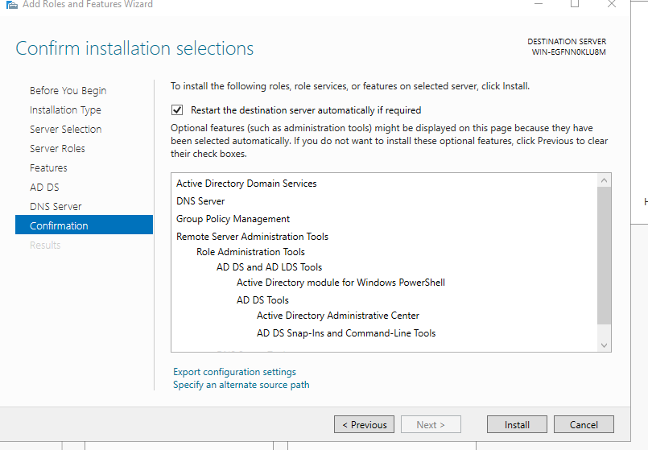
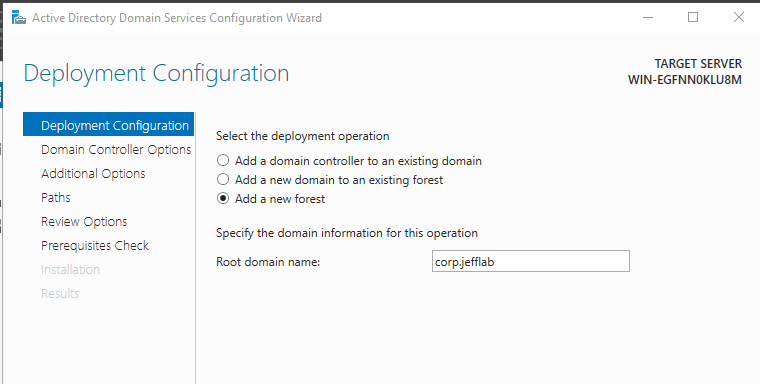
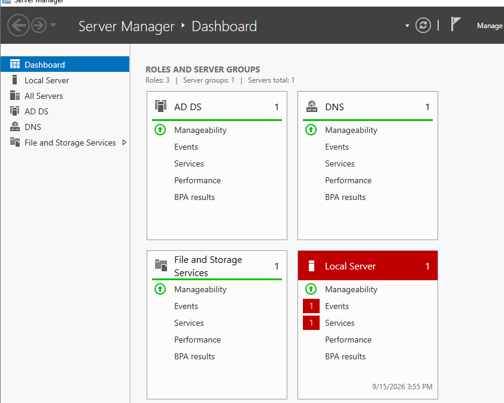
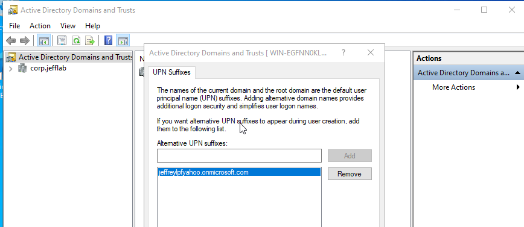
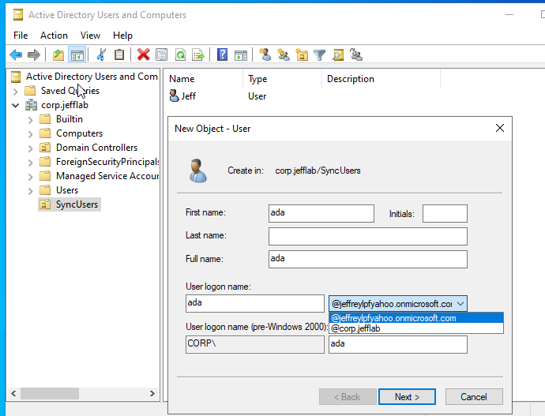
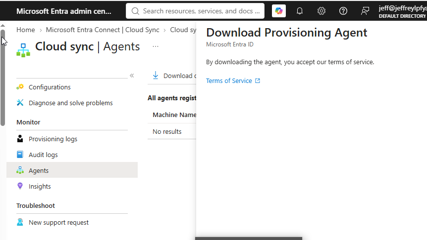
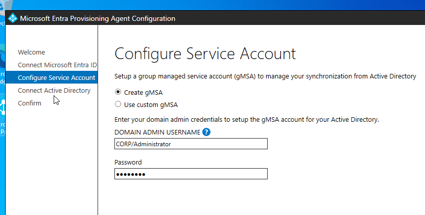
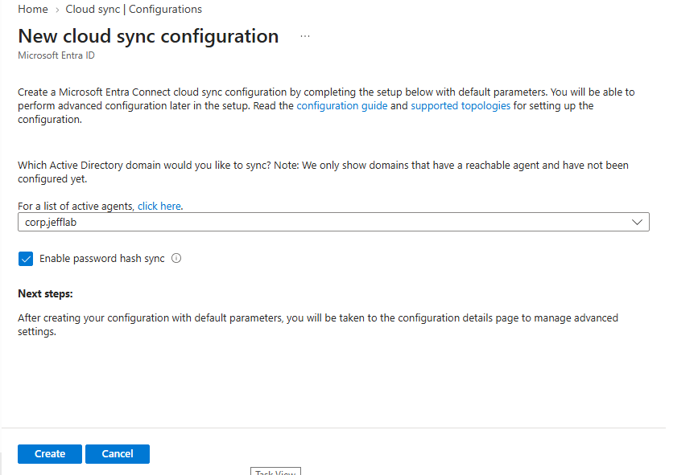
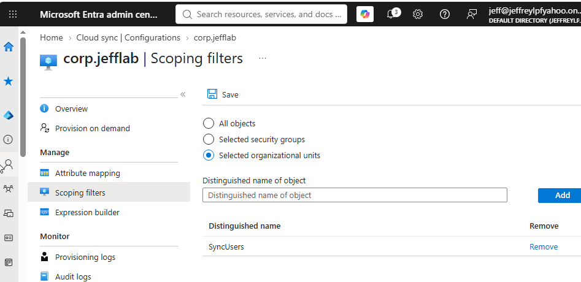

# Hybrid Identity Lab: Active Directory to Microsoft Entra ID with Cloud Sync

> A hybrid identity environment that connects an on-premises Active Directory to
> Microsoft Entra ID using Microsoft Entra Cloud Sync with password hash sync. This
> lab covers the full build, a domain controller, scoped provisioning, the Cloud
> Sync agent, and password hash sync, and then documents a systematic root-cause
> investigation of a sync-agent connectivity fault encountered in the lab
> environment.


> **Status note.** The hybrid environment is fully built and correctly configured,
> as the screenshots below show. The data sync itself did not complete in this lab
> due to an environmental agent-connectivity fault (the provisioning agent could not
> establish its persistent WebSocket to Azure Service Bus). That fault was isolated
> through systematic elimination and the agent's own trace log, and is documented in
> the [Troubleshooting and Root-Cause Analysis](#troubleshooting-and-root-cause-analysis)
> section. The build and the diagnosis are both intended deliverables of this lab.

---

## Overview

Most enterprises are not cloud-only. They run an on-premises Active Directory that
predates their move to the cloud, and identities have to exist in both places at
once: on-prem for legacy apps and file shares, and in Microsoft Entra ID for
Microsoft 365 and SaaS. Hybrid identity is the discipline of keeping those two
directories in sync from a single authoritative source, so a user is provisioned,
changed, and deprovisioned in one place and the change flows everywhere.

This lab builds and configures that pipeline with **Microsoft Entra Cloud Sync**,
the current recommended tool for new deployments. Cloud Sync uses a lightweight,
auto-updating provisioning agent with no on-premises SQL database and no heavy sync
engine; the synchronization logic runs in Microsoft's cloud. The intended result is
on-premises AD users synced up into an Entra tenant with **password hash sync**, so
the same credential works in both directories.

## Why Cloud Sync (not Connect Sync)

Microsoft's current guidance is that Cloud Sync is the recommended choice for new
projects, with the legacy Connect Sync retained only for complex scenarios such as
pass-through authentication, group writeback, or custom transformation rules.
Choosing Cloud Sync here reflects the direction Microsoft is steering all customers.

| | Cloud Sync | Connect Sync (legacy) |
|---|---|---|
| Agent | Lightweight, auto-updating | Heavy, manual updates |
| On-prem database | None | SQL / LocalDB |
| Recommended for | New deployments | Complex edge cases |
| Managed by | Microsoft cloud | On-prem server |

## Architecture


| Component | Role |
|-----------|------|
| Windows Server (AD DS) | On-premises domain controller and authoritative source |
| Entra provisioning agent | Lightweight connector installed on the DC |
| Microsoft Entra Cloud Sync | Cloud-hosted synchronization service |
| Microsoft Entra ID | Target cloud directory |

---

## Build

Each stage below pairs the configuration step with the reason it matters. The
identity milestones are shown inline; procedural build screens are collapsed but
available for verification.

### 1. Domain controller foundation

A Windows Server VM is promoted to a domain controller for a new forest
(`corp.jefflab`), after being given a static IP (a DC's address cannot move, since
it also serves as the domain's DNS). The AD DS and DNS roles install together, and
the promoted server hosts the authoritative directory.

**Why it matters:** The domain controller is the authoritative source for the whole
hybrid pipeline. Every identity that would sync to the cloud originates here, so the
on-prem directory has to exist and be healthy before anything can flow upward. This
stage also demonstrates on-premises infrastructure skills, not just cloud console
operation.

<details>
<summary><b>Click to view domain controller build screenshots</b></summary>

<br/>







</details>

### 2. Sync scope: UPN suffix, OU, and users

Before creating the users to be synced, an alternative UPN suffix matching the
verified Entra domain (`jeffreylpfyahoo.onmicrosoft.com`) is added, so synced users
would receive routable, sign-in-ready usernames rather than unusable internal ones.
A dedicated organizational unit (`SyncUsers`) then holds exactly the users in scope.

**Why it matters:** The UPN suffix step is the classic hybrid pitfall: an on-prem
`user@corp.jefflab` UPN is non-routable and will not work as a cloud sign-in, so
matching the suffix to a verified Entra domain up front is what makes synced
identities usable. Cloud Sync scopes by organizational unit, so a dedicated OU gives
precise control over exactly who leaves the on-prem boundary.





### 3. Provisioning agent installation

The lightweight Entra provisioning agent is downloaded from the Entra admin center
and installed on the domain controller (a supported configuration). During setup it
creates a group managed service account (gMSA) to run its service.

**Why it matters:** The agent is the only on-premises footprint of Cloud Sync. It
makes outbound connections to Microsoft's cloud and auto-updates, which is what
makes Cloud Sync lightweight compared to the legacy sync engine. Running it under a
gMSA means its credentials are managed automatically by AD rather than being a static
password an administrator has to rotate.

<details>
<summary><b>Click to view provisioning agent install screenshots</b></summary>

<br/>





</details>

### 4. Cloud Sync configuration

A synchronization configuration is created in the Entra admin center: AD to Entra,
password hash sync enabled, scoped to the `SyncUsers` OU. The domain was selectable
in the configuration, which the portal only offers for domains with a reachable
agent, confirming the agent registered successfully.

**Why it matters:** This is where the sync behavior is defined. Password hash sync
lets the same credential authenticate in both directories, and OU scoping enforces
that only intended users leave the on-prem boundary, a deliberate, controlled rollout
rather than syncing an entire directory blindly.

<p float="left">
  
  
</p>

The configuration targets the `corp.jefflab` domain with password hash sync enabled
(left), scoped to the dedicated `SyncUsers` OU (right).

---

## Troubleshooting and Root-Cause Analysis

With the environment fully built, the sync did not complete: the configuration
entered a provisioning quarantine, the provisioning logs stayed empty, and both the
scheduled cycle and provision-on-demand failed with timeouts. Rather than stop at
"it doesn't work," the failure was diagnosed by systematically eliminating every
possible cause and reading the agent's own trace log to isolate the exact mechanism.

### Symptoms

- Configuration status cycled to **Provisioning quarantine**, error code
  `HybridIdentityServiceAgentTimeout`.
- Provisioning logs remained empty; no objects were ever processed.
- Provision-on-demand timed out rather than returning a specific error.
- The portal intermittently reported no active agent for the domain, despite the
  agent service running locally.

### What was verified correct (and therefore ruled out)

Each of these was tested and confirmed healthy, eliminating it as the cause:

| Layer | Check | Result |
|-------|-------|--------|
| Source object | AD user enabled, correct UPN suffix, in the scoped OU | Correct |
| Service account | gMSA exists, enabled, and usable (`Test-ADServiceAccount` = True) | Correct |
| Directory permissions | `Authenticated Users` has read on the SyncUsers OU | Correct |
| DNS | Forwarder added; external names resolve | Correct |
| Connectivity | Registration and login endpoints reachable on 443 | Correct |
| TLS | TLS 1.2 enforced for .NET via registry | Applied |
| Certificate trust | Root certificate store refreshed; CRL/OCSP endpoints reachable on 80 | Correct |
| Host security software | Third-party AV (Norton) removed from the host | Removed |
| Agent registration | Agent registered; domain selectable in Cloud Sync config | Correct |

### Isolating the fault with the agent trace log

When the portal showed nothing, the agent's local trace log named the real fault
directly and repeatedly:

```
AADConnectProvisioningAgent.exe Error: 0 : Web socket failed to connect.
  at Microsoft.ApplicationProxy.Connector.Listeners.ConnectorSignalingWebSocket...
Retryable Operation is rethrowing error after failed with Exception:
  'System.NullReferenceException: Object reference not set to an instance of an object.
```

The agent maintains its connection to Microsoft over a persistent WebSocket to Azure
Service Bus. That WebSocket handshake fails to establish, and every downstream error
(the null-reference exceptions, the infinite retries, the quarantine, the "no active
agent") is a consequence of that single failure. Critically, ordinary short-lived
HTTPS to the same Microsoft endpoints succeeds, only the sustained WebSocket upgrade
fails, which is the signature of a network layer that permits standard HTTPS but does
not correctly pass a long-lived WebSocket connection.

### Root cause

The environment is correctly configured. The fault is environmental: the virtualized
lab network path does not sustain the provisioning agent's persistent WebSocket to
Azure Service Bus. This matches a documented community failure pattern with the
identical error signature, attributed to low-level HTTPS/WebSocket handling at the
virtualization or ISP layer rather than to any misconfiguration of the agent, the
directory, or the tenant.

### What I would do next in a production context

- Run the provisioning agent on a host with a clean, un-inspected network path (a
  physical server or a cloud-hosted VM) rather than a NAT/bridged VM on a consumer
  network.
- Confirm no TLS-inspecting middlebox sits between the agent and
  `*.msappproxy.net` / `*.servicebus.windows.net`, which Microsoft explicitly does
  not support for this traffic.
- Validate the WebSocket path specifically, not just port reachability, since
  standard 443 tests pass while the sustained connection fails.

---

## Key Concepts Demonstrated

Hybrid identity architecture; on-premises Active Directory as an authoritative
source; Microsoft Entra Cloud Sync with a lightweight provisioning agent; password
hash synchronization; UPN routing and verified-domain alignment; OU-scoped sync;
group managed service accounts; and systematic root-cause analysis of a distributed
sync-agent failure.

## Skills Demonstrated

- Hybrid identity design and Active Directory to Entra ID synchronization
- Windows Server AD DS: domain controller build, DNS, forest promotion
- Microsoft Entra Cloud Sync deployment and provisioning-agent installation
- Password hash sync and UPN/verified-domain configuration
- OU-scoped, controlled sync configuration
- Structured troubleshooting and root-cause analysis: eliminating causes layer by
  layer (DNS, connectivity, TLS, certificate trust, permissions, host security),
  reading agent trace logs, and isolating a fault to a specific mechanism

## Tech Stack

Windows Server (AD DS), Microsoft Entra ID, Microsoft Entra Cloud Sync, Microsoft
Entra provisioning agent.

## What I Learned

Building the hybrid pipeline was straightforward; diagnosing why it wouldn't sync was
the real work, and the more valuable part. A few things this lab taught me beyond the
happy path: switching the VM's network adapter silently broke DNS resolution, which
then masqueraded as a dozen unrelated failures until I traced it back; a bare
`servicebus.windows.net` reachability test is misleading because it isn't a real
connectable endpoint, which briefly sent me down a wrong path; a healthy-looking
agent in the portal does not mean it holds a live cloud session; and the decisive
evidence was never in the portal at all but in the agent's local trace log, which
named the failing WebSocket directly. Most of all, I learned to distinguish a
configuration error from an environmental one: when every controllable layer checks
out and the failure persists across network modes, the honest and correct conclusion
is to root-cause the environment rather than keep changing settings.

## About

Built by Jeffrey Lam-Ping-Fong, a fourth-year Honours Bachelor of Information
Technology student specializing in cybersecurity, with a focus on identity and
access management.

- LinkedIn: https://www.linkedin.com/in/jeffrey-lam-ping-fong-07a649321
